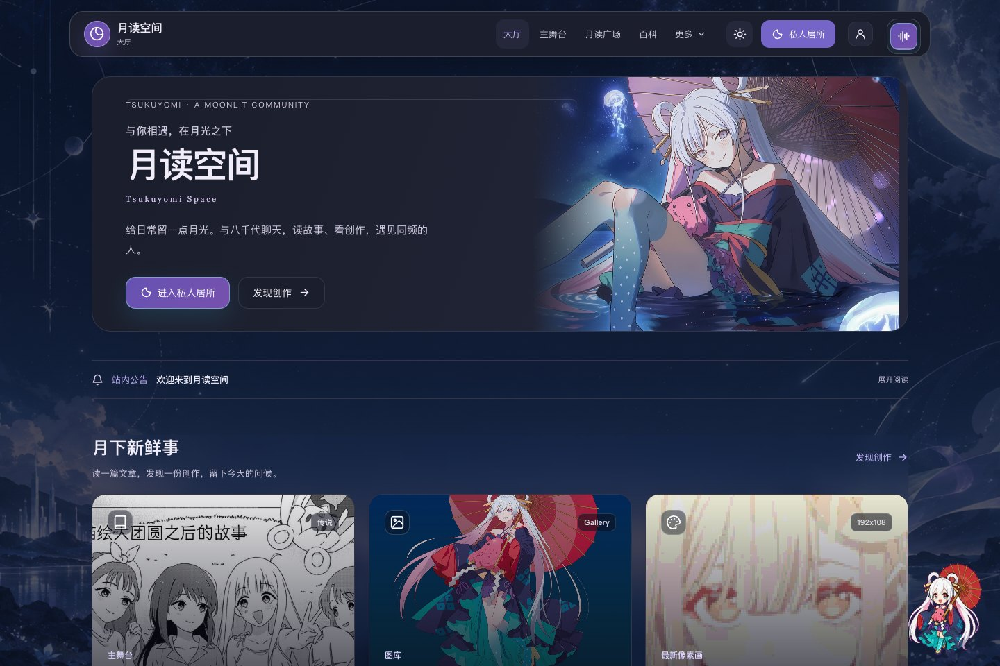
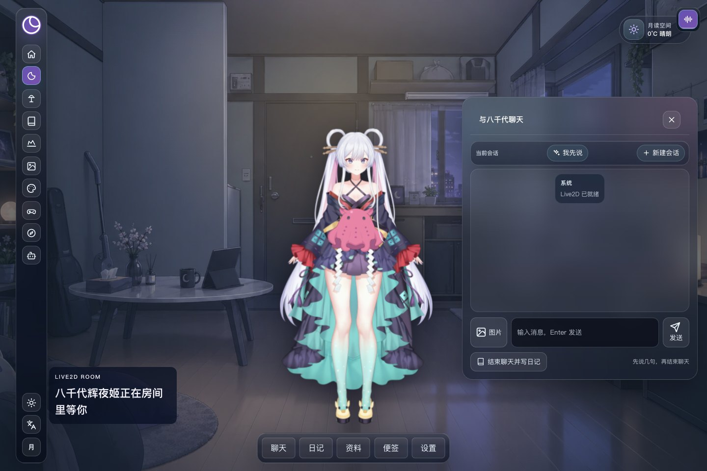
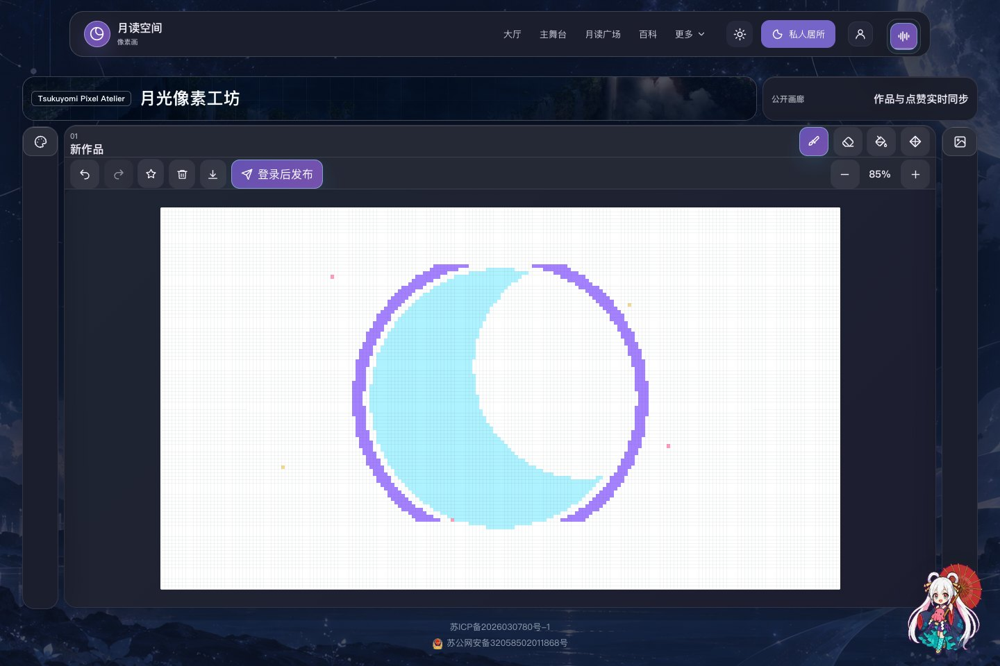
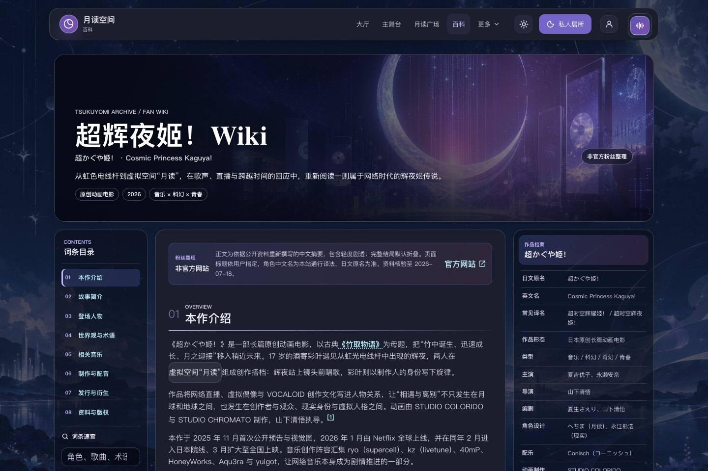
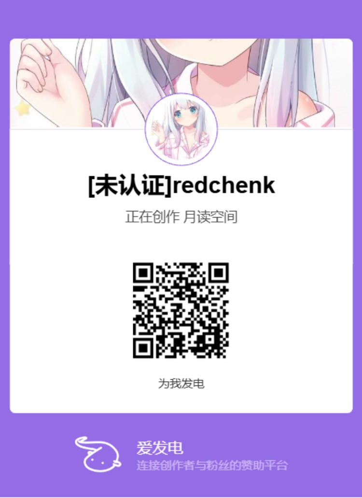

# Tsukuyomi Space
一个围绕《超时空辉夜姬！》世界观构建的非盈利同人社区与 Live2D AI 角色空间。

项目以 Vue 3 与 Express 构建，把 Live2D 角色陪伴、账号隔离的长期记忆、内容创作、社区互动、成长任务和公开 Wiki 连接在同一个月读空间中。

## 在线访问

| 站点 | 地址 | 语言与用途 |
| --- | --- | --- |
| 国内站 | [yachiyo.hk](https://yachiyo.hk) | 中文 / 日语切换，完整功能入口 |
| 海外站 | [tsukuyomi-space.com](https://tsukuyomi-space.com) | 英文界面，海外访问入口 |
| 站点动态 | [RSS](https://yachiyo.hk/feed.xml) · [JSON](https://yachiyo.hk/api/site-feed) | 文章、留言、图库、像素画与友链更新 |

[](https://yachiyo.hk/hub)

## 项目预览

| [Hub 中枢大厅](https://yachiyo.hk/hub) | [Live2D AI 私人房间](https://yachiyo.hk/room) |
| --- | --- |
|  |  |
| [192×108 像素工坊](https://yachiyo.hk/pixel) | [超时空辉夜姬 Wiki](https://yachiyo.hk/wiki) |
|  |  |

## 支持项目

如果月读空间为你带来了帮助，可以通过爱发电自愿支持服务器、对象存储、CDN 与持续维护。支持不会影响站内功能、内容审核或用户权限。

<p align="center">
  <a href="https://www.ifdian.net/a/redchenk?utm_source=copylink&amp;utm_medium=link">
    
  </a>
</p>

<p align="center"><a href="https://www.ifdian.net/a/redchenk?utm_source=copylink&amp;utm_medium=link">前往爱发电支持月读空间</a></p>

## 亮点

- **Live2D AI 房间**：天气与时间驱动场景，支持浏览器侧 LLM、Ollama、TTS、音乐、图片输入和 Live2D 表情协同。
- **跨端私人记忆**：会话与长期记忆按账号隔离，通过实时事件同步；支持本地向量检索和可选 Milvus。
- **用户成长循环**：每日签到、首次聊天、每日分享、轮换内容任务、连续七天奖励和邀请成长，等级会出现在用户与内容身份区域。
- **真实内容社区**：文章、留言、图库、附件、像素画和友链均有发布、点赞、实时刷新、个人管理与管理员审核流程。
- **传播与分享**：文章和像素作品提供社交媒体跳转；Room 可发布选定对话片段，并为分享链接生成独立 OG 信息。
- **超时空辉夜姬 Wiki**：角色、世界观、音乐、制作与衍生资料拥有独立词条、搜索入口和服务端爬虫页面。
- **多语言与双站部署**：国内站支持中文 / 日语切换，海外站提供强制英文构建，共享同一套功能与安全策略。
- **全局 AI 向导**：右下角八千代宠物可复用 Room 的 LLM 配置回答站内功能问题，未配置时提供固定帮助。
- **账号与通知**：支持注册、QQ OAuth、邮箱验证、密码找回、QQ 解绑、Cookie 会话、未读角标和服务端分页站内信。
- **对象存储与动态订阅**：支持本地磁盘、S3 兼容存储和阿里云 OSS；提供 JSON 站点动态与 RSS。
- **轻量而完整的部署**：支持 Docker Compose 或 PM2 + Nginx / OpenResty，数据库、上传目录、应用源码和备份分权管理。
- **纵深安全边界**：包含严格 CSP、安全响应头、CSRF 来源校验、重复 JSON 键拒绝、上传检测、SSRF 防护和分级管理权限。

## 核心模块

| 模块 | 说明 |
| --- | --- |
| Hub | 站点中枢大厅，聚合主要入口、广场动态、文章预览和访问统计 |
| Room | Live2D AI 私人房间，包含聊天、长期记忆、资料、便签、天气、音乐、TTS 和独立设置页 |
| Growth | 月契成长中心，提供每日任务、连续签到、等级、邀请关系和与八千代联动的成长反馈 |
| Stage / Article | 文章列表、详情阅读、编辑器和管理端内容发布流程 |
| Plaza | 留言广场，支持留言、回复、点赞和管理员审核 |
| Gallery / Attachments | 图库与附件库，支持上传者展示、个人管理、审核和对象存储 |
| Pixel | `/pixel` 固定 192×108 画布的像素工坊，支持触控笔、发布、点赞、分享和 PNG 导出 |
| Game | `/game` 辉夜姬主题节奏跑酷游戏，支持桌面键盘、移动端触控与全屏游玩 |
| Wiki | 角色、世界观、音乐、发行与衍生资料总览，以及独立角色和术语词条 |
| Friend Links | 公开友链目录与独立申请、审核流程 |
| Agent OS | `/agent-os` 独立应用入口，运行时请求复用站内登录校验 |
| Notifications | 分页站内信、已读状态、未读角标与内容跳转 |
| User Center | 用户资料、文章、留言、收藏、作品和账号安全管理 |
| Admin | 面向 `admin` / `super_admin` 的文章、留言、图库和附件审核工作台 |
| Terminal | 管理用户权限、友链、访问统计、对象存储和系统配置 |
| Reality | 联系方式、隐私说明、责任边界和第三方技术 / 素材来源 |

## 技术栈

- 前端：Vue 3、Vite、CSS3、原生 JavaScript、Live2D Cubism、Anime.js、Lucide 图标
- 后端：Node.js、Express、better-sqlite3
- 数据与缓存：SQLite、可选 Redis、可选 Milvus 向量库
- 认证：JWT、Cookie、bcryptjs、QQ OAuth、邮箱验证码
- 存储：本地受控上传、S3 兼容对象存储 / 阿里云 OSS
- 集成：Agent OS、MCP、RSS / JSON Feed、多邮箱聚合 API
- 测试：node:test、Playwright
- 部署：Docker Compose、PM2、Nginx / OpenResty、GitHub Actions、SSH、国内 / 海外双站

## 设计系统

前端设计系统位于 `src/frontend/styles/`，用于稳定“简约清爽 + 现代感 + 二次元动漫风格”的整体视觉：

- `tokens.css`：色彩、字体、间距、圆角、阴影、动效时长等基础 token
- `themes.css`：深色 / 浅色主题变量，以及旧变量名兼容映射
- `components.css`：按钮、卡片、面板、导航、输入框等通用组件样式
- `animations.css`：全局背景动效、页面入场和动效节奏
- `responsive.css`：全局移动端断点和导航响应式规则

新增页面优先使用 `--ts-*` 变量；旧的 `--moon-*`、`--panel`、`--radius` 等变量会继续映射到设计系统，便于逐步迁移。

## 快速开始

需要 Node.js 20 或以上版本。

```bash
npm install
npm run dev
```

开发环境会并行启动 API 和前端：

- 前端开发服务：`http://localhost:5173/`
- API 服务：`http://localhost:3000/api/health`

常用脚本：

- `npm run dev` / `npm run dev:all`：并行启动后端 API 和 Vite 前端
- `npm run dev:api`：只启动 Express API
- `npm run dev:web`：只启动 Vite 前端
- `npm test`：执行语法检查、数据库迁移、API、安全和前端回归测试
- `npm run test:api`：执行 auth、articles、messages、admin、room memory、MCP 等接口测试
- `npm run test:e2e`：执行 Playwright 端到端主流程测试，需要先构建前端或提供 `E2E_BASE_URL`
- `npm run build:web`：构建 Vue 前端产物
- `npm run build:live2d`：重新构建 Live2D 房间运行时

## 项目结构

```text
tsukuyomi-space/
├── assets/          # 图片、README 示例图、图标、音频和样式等静态资源
├── backend/         # Express API、SQLite 初始化、路由和中间件
├── deploy/          # PM2、Nginx、部署脚本样例
├── docs/            # 部署和维护文档
├── docker-compose.yml # Docker Compose 生产部署入口
├── dist/frontend/   # npm run build:web 生成的 Vue 前端产物
├── lib/             # Live2D / 前端运行库
├── models/          # Live2D 模型资源
├── src/frontend/    # Vue 3 + Vite 主线前端源码
│   └── styles/      # 设计系统 token、主题、组件、动画和响应式规则
├── tests/           # API 与 Playwright 端到端测试
├── .env.example     # 生产环境变量模板
└── package.json     # 项目脚本与依赖
```

## 配置

生产环境必须设置：

- `NODE_ENV=production`
- `JWT_SECRET`：至少 32 字符，建议用 `openssl rand -base64 48` 生成
- `MAIL_CREDENTIAL_KEY`：用于加密聚合邮箱凭据，建议使用与 JWT 不同的独立随机密钥
- `ADMIN_PASSWORD`：首次创建或重置管理员时使用
- `CORS_ORIGINS`：线上域名，例如 `https://your-domain.example`
- `DATA_DIR` 或 `DB_PATH`：SQLite 数据库存放路径
- `REDIS_URL`：可选，例如 `redis://127.0.0.1:6379/0`。配置后验证码、限流、天气缓存、登录失败次数和 token 黑名单会优先使用 Redis；未配置或 Redis 暂不可用时会退回进程内存储。

复制 `.env.example` 到服务器的 `/etc/tsukuyomi-space/tsukuyomi-space.env`。真实 `.env`、密码、API Key 不应提交到仓库。

## 数据库迁移

启动时会自动执行 `backend/db/migrations/` 下按版本号排序的迁移脚本，并把执行记录写入 `schema_migrations` 表。

生产部署前必须先备份 SQLite。`deploy/deploy.sh` 会在安装依赖、构建和 PM2 reload 前自动备份 `DB_PATH` 或 `DATA_DIR/tsukuyomi.db` 到 `BACKUP_DIR`，默认目录是 `/var/backups/tsukuyomi-space/deploy`。脚本会分别清理该目录和 `DATABASE_BACKUP_DIR`（默认 `DATA_DIR/backups`），每处只保留由 `BACKUP_RETENTION` 指定的最新备份，默认 10 份。

新增迁移时使用 `NNN_description.js` 命名，例如 `003_add_article_indexes.js`，并导出：

```js
module.exports = {
  version: '003',
  name: 'add_article_indexes',
  up(db) {
    db.exec('CREATE INDEX IF NOT EXISTS idx_articles_status ON articles(status)');
  }
};
```

## Room / Agent 能力

Room 页面正在向个人 Agent 方向演进，当前能力包括：

- LLM 与 TTS 请求默认从用户浏览器侧发出，减少用户对话和 API Key 经由站点后端转发。
- 登录用户的会话与长期记忆保存在服务端并按账号隔离，通过账号会话和实时事件跨设备同步；未登录访客退回浏览器本地存储。
- 记忆检索支持本地向量，并可选接入 Milvus；数据库边界和向量查询都会携带用户作用域。
- 房间设置页提供“记忆管理”，默认折叠，展开后可搜索、查看、编辑、删除当前用户的记忆。
- 角色知识库保存在浏览器 `localStorage`，默认内置八千代身份、人设、说话风格、关系和限制条目，用户可自行新增、编辑、停用或恢复默认。
- 聊天时会把相关长期记忆、角色知识、真实天气、最新站点动态和可用 MCP 工具一起组织进上下文。
- 八千代能够读取用户当前等级、签到与任务状态；每天第一次对话前会显示一次“今日约定”成长入口。
- 登录用户可以选择一轮问答生成公开对话卡，分享链接会还原对应场景，并提供独立标题、描述和 OG 图片。
- MCP 支持自定义 JSON-RPC 端点，以及 MiniMax Token Plan 的站内受限桥接；图片理解在 LLM 不支持多模态时会尝试调用 MCP。
- LLM 支持受控的云服务直连，也支持浏览器直连用户本机 `http://localhost:11434` 的 Ollama；本机模式不会把对话转发到本站服务器。
- Room 音乐播放卡片读取服务器静态目录 `/assets/music/` 下的歌曲文件；音乐资源体积较大，不提交到 Git，部署时单独上传。
- Room 天气卡片会优先使用用户浏览器定位获取所在地天气，并作为聊天上下文的一部分。

Room 相关设置主要保存在浏览器本地，包括：

- `roomLLMSettings`
- `roomTTSSettings`
- `roomMCPSettings`
- `roomMemorySettings`
- `roomKnowledgeSettings`
- `roomMusicTrackIndex`
- `roomMusicVolume`

从 HTTPS 站点连接本机 Ollama 时，需要允许浏览器访问本地网络，并为 Ollama 配置可信来源后完整重启：

```powershell
[Environment]::SetEnvironmentVariable('OLLAMA_ORIGINS','https://yachiyo.hk,https://yachiyo.com.cn,https://cho-kaguyahime.cn','User')
```

## 内容、分享与订阅

- 文章、留言、图库、像素画和友链等公开列表使用路径级缓存破坏与服务端缓存失效，发布后会请求最新内容。
- 文章详情和像素作品提供复制链接及社交媒体分享入口；用户分享行为会进入每日成长任务，但奖励只由服务端判定一次。
- Room 对话分享只发布用户主动选择的单轮内容，不会公开整段私人会话或长期记忆。
- JSON 动态接口为 `/api/site-feed`，RSS 地址为 `/feed.xml` 或 `/api/site-feed/rss`。
- 对象存储配置位于超级管理员终端；数据库只保存受控资源索引，公开访问仍通过站点资产接口或配置的 CDN 域名。
- 部署与数据库备份默认各保留最近 10 份，可通过 `BACKUP_RETENTION` 调整。

海外英文构建使用同一份源码：

```bash
VITE_SITE_LANGUAGE=en npm run build:web
```

## Docker 快速部署

```bash
cp .env.docker.example .env.docker
# 修改 JWT_SECRET、ADMIN_PASSWORD、CORS_ORIGINS 等生产配置
docker compose up -d --build
curl http://127.0.0.1:3280/api/health

# Optional on a sufficiently large host: enable Milvus before importing the persona corpus.
docker compose --profile milvus up -d
docker compose cp ./data/yachiyo_novel_detailed_corpus.txt tsukuyomi-space:/data/yachiyo_novel_detailed_corpus.txt
docker compose exec tsukuyomi-space npm run import:yachiyo -- --file /data/yachiyo_novel_detailed_corpus.txt --clear
```

Docker 部署会把 SQLite 持久化到 Compose 命名卷 `tsukuyomi-data`，容器内路径为 `/data/tsukuyomi.db`。SQLite 向量检索是默认的轻量记忆后端；Milvus 通过 `milvus` profile 按需启用。服务器本地额外音乐、视频背景和 Live2D 模型推荐通过 `docker-compose.resources.example.yml` 只读挂载，不打进镜像。

推荐更新命令：

```bash
bash deploy/docker-deploy.sh
```

## 部署

推荐新环境优先使用 Docker Compose；现有服务器也可以继续使用 PM2 运行后端，Nginx 处理静态文件并反向代理 `/api/`：

```bash
bash deploy/deploy.sh

# PM2 deployments can import the persona corpus from the host filesystem.
ROOM_MEMORY_VECTOR_BACKEND=milvus MILVUS_ADDRESS=127.0.0.1:19530 npm run import:yachiyo -- --file "E:\visualstudio\yachiyo_novel_detailed_corpus.txt" --clear
```

完整步骤见 [docs/DEPLOY.md](docs/DEPLOY.md)。

当前生产环境采用国内完整应用与海外英文静态前端双站部署。前端通过带哈希的静态资源和原子 release 切换发布，避免更新过程中出现混合版本。

## 安全说明

- 生产环境没有强 `JWT_SECRET` 会拒绝启动。
- 生产环境首次创建管理员时必须提供 `ADMIN_PASSWORD`。
- 管理员终端所有数据接口都需要管理员 JWT。
- API 已加入基础安全响应头、CORS 白名单和 Redis 优先的限流。
- CSP 由 HTTP 响应头统一下发，并限制脚本、媒体、框架、连接目标和对象资源来源。
- Cookie 写操作校验可信请求来源，JSON 请求拒绝重复键，上传文件同时校验扩展名、MIME 与文件特征。
- 外部请求与对象存储地址经过 SSRF 校验，管理员操作按 `admin` / `super_admin` 权限分层。
- 公开内容中的外部链接会经过协议与风险处理，留言、文章、图库、附件和友链提供独立审核边界。
- SQLite 默认存放在 `DATA_DIR`，不应提交到 Git。
- 权限模型见 [docs/PERMISSIONS.md](docs/PERMISSIONS.md)。
- Room 长期记忆说明见 [docs/ROOM_MEMORY.md](docs/ROOM_MEMORY.md)。

## 技术与素材来源

- Agent OS 页面音乐 App 的技术实现来源于 [firefly20041001/Yachiyo](https://github.com/firefly20041001/yachiyo)，原项目采用 Electron、React、TypeScript，并以 Apache-2.0 许可证发布。
- 站内 Live2D、角色视觉与音乐素材版权归原作者及相关权利方所有；项目仅用于非盈利个人展示与交流。
- 右下角网页宠物来源于 [Petdex / Yachiyo](https://petdex.dev/zh/pets/yachiyo)，界面图标使用 [Lucide](https://lucide.dev/)。
- 更完整的来源、隐私和责任边界请查看站内 [`/reality`](https://yachiyo.hk/reality) 页面。

## License

项目自有代码以 MIT 许可证发布。第三方代码、模型、音乐、图片和角色素材分别遵循其原始许可证与权利声明。
