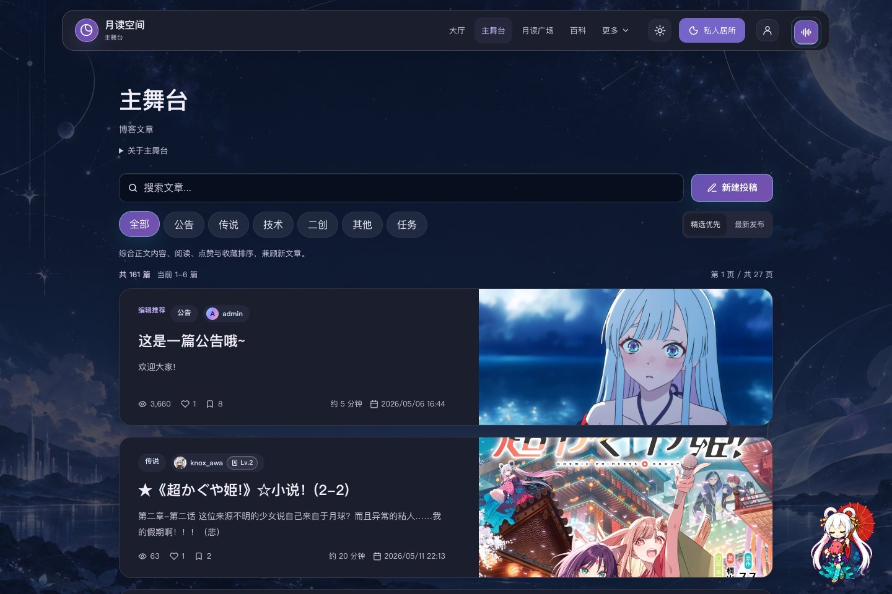

# Tsukuyomi Space · 月读空间

[简体中文](README.md) | [English](README_EN.md)

**Leave a little moonlight in your day. Talk with Yachiyo, read stories, discover creations, and meet kindred spirits.**

Tsukuyomi Space is a nonprofit fan community inspired by the world of *Cosmic Princess Kaguya!*. Built with Vue 3 and Express, it brings together a Live2D AI companion, creative publishing, community interaction, and a public fan wiki.

[Chinese / Japanese site](https://yachiyo.hk) · [English site](https://tsukuyomi-space.com) · [Deployment guide](docs/DEPLOY.md) · [Report an issue](https://github.com/redchenk/tsukuyomi-space/issues)

[Preview](#preview) · [Core experiences](#core-experiences) · [Quick start](#quick-start) · [Deployment and configuration](#deployment-and-configuration) · [Developer documentation](#developer-documentation) · [Support the project](#support-the-project)

[](https://tsukuyomi-space.com/hub)

## Preview

These screenshots were captured from the public Chinese site on **September 16, 2026**, at a 1440 × 960 desktop viewport while signed out. Community content, time, and weather scenes may change.

| Live2D AI Room | Stage · Articles and creations |
| --- | --- |
| [](https://tsukuyomi-space.com/room) | [](https://tsukuyomi-space.com/stage) |
| **192 × 108 Pixel Atelier** | **Cosmic Princess Kaguya! Wiki** |
| [](https://tsukuyomi-space.com/pixel) | [](https://tsukuyomi-space.com/wiki) |

## Core experiences

- **Spend time with Yachiyo:** Live2D animation, chat, expressions, TTS, music, and weather-aware scenes come together in a private Room. Connect a cloud LLM or a local Ollama instance, and extend the Room with MCP tools.
- **Keep conversations going:** Signed-in conversations and long-term memories are isolated by account and synchronized across devices. The Room includes memory management, a character knowledge base, character diaries, and persona backup import.
- **Create and connect:** Read articles on the Stage, post messages in the Plaza, share artwork in the Gallery, or draw, publish, and export pixel art on a fixed 192 × 108 canvas.
- **Explore the story world:** The public Wiki collects characters, lore, music, and production information. A themed rhythm runner supports keyboard, touch, and fullscreen play.
- **Make each visit count:** The Moon Pact growth center includes check-ins, daily tasks, streak rewards, referrals, and notifications for community activity.
- **A consistent moonlit interface:** Dark and light themes, responsive navigation, and shared design tokens span the main pages. The domestic site supports Chinese and Japanese, while the international site provides an English interface.

## Quick start

Use **Node.js 22.12+**. The current Vite release also supports Node.js 20.19+. Install dependencies once from the repository root; a separate install inside `backend/` is not required.

```bash
git clone https://github.com/redchenk/tsukuyomi-space.git
cd tsukuyomi-space
npm ci
npm run dev
```

The development command starts both the frontend and the API:

| Service | URL |
| --- | --- |
| Vite frontend | http://localhost:5173/ |
| API health check | http://localhost:3000/api/health |

Development uses a local SQLite database by default, and database migrations run automatically when the API starts. Redis, Milvus, SMTP, and third-party AI services are optional. Configure the relevant providers in the Room settings to enable chat and speech. Large local assets such as additional music and video backgrounds must be supplied separately; see the [deployment guide](docs/DEPLOY.md).

### Common commands

| Command | Purpose |
| --- | --- |
| `npm run dev` | Start the API and frontend together |
| `npm run dev:api` / `npm run dev:web` | Start only the API / frontend |
| `npm run build:web` | Build the frontend into `dist/frontend/` |
| `npm run build:web:overseas` | Build the English site with the overseas environment |
| `npm run build:live2d` | Rebuild the Live2D Room runtime |
| `npm run dev:live2d-studio` | Start the Live2D Studio development server |
| `npm test` | Run syntax checks plus API and frontend regression tests |
| `npm run test:api` / `npm run test:frontend` | Run API / frontend regression tests separately |
| `npm run test:e2e` | Run Playwright end-to-end tests |

Before running end-to-end tests, run `npm run build:web` and install the browser with `npx playwright install chromium`. You can also set `E2E_BASE_URL` to use an existing test deployment.

## Deployment and configuration

For a new environment, use Docker Compose:

```bash
cp .env.docker.example .env.docker
# Edit .env.docker and replace the secrets, administrator password, and site domains.
docker compose up -d --build
curl http://127.0.0.1:3280/api/health
```

The default port is bound to the server loopback address at `127.0.0.1:3280`. Configure a reverse proxy and HTTPS for public access. SQLite data and user uploads are persisted in the `tsukuyomi-data` and `tsukuyomi-uploads` named volumes.

| Variable | Description |
| --- | --- |
| `JWT_SECRET` | Required in production and must contain at least 32 characters; generate one with `openssl rand -base64 48` |
| `ADMIN_PASSWORD` | Required when the first production administrator is created; replace the example value |
| `CORS_ORIGINS` | Public origins allowed to access the API |
| `MAIL_CREDENTIAL_KEY` | Encryption key for aggregated mailbox credentials; generate and retain a separate stable key |
| `DATA_DIR` / `DB_PATH` | SQLite persistence paths; Docker uses `/data` by default |
| `REDIS_URL` | Optional; stores verification codes, rate limits, weather cache data, and token revocations |
| `ROOM_MEMORY_BACKEND` | `mem0` by default: embedded OSS SDK with local SQLite; `sqlite` selects fallback retrieval |
| `ROOM_MEM0_DB_PATH` | Index file; defaults to `room-mem0.db` beside the main database |

See [`.env.example`](.env.example) and [`.env.docker.example`](.env.docker.example) for the full configuration. Never commit real environment files, passwords, or API keys.

- **Docker updates:** run `bash deploy/docker-deploy.sh`.
- **PM2 + Nginx / OpenResty:** existing servers can use the traditional deployment path described in the [deployment guide](docs/DEPLOY.md).
- **Optional services and large assets:** the guide covers Redis and Milvus profiles, as well as read-only mounts for models, music, and video.
- **Database migrations:** files in `backend/db/migrations/` run automatically at startup. Back up production data before updating. Deployment and database backups each retain the latest 10 copies by default; change this with `BACKUP_RETENTION`.

## Developer documentation

The detailed documents are currently maintained in Chinese.

| Document | Contents |
| --- | --- |
| [Deployment and operations](docs/DEPLOY.md) | Docker, PM2, reverse proxies, asset mounts, backup, and recovery |
| [Permission model](docs/PERMISSIONS.md) | User, administrator, and super administrator boundaries |
| [Room long-term memory](docs/room-memory.md) | Memory storage, retrieval, and user isolation |
| [Room rendering performance](docs/room-rendering-performance.md) | Live2D rendering and performance strategy |
| [Wiki maintenance](docs/WIKI.md) | Wiki content and page maintenance |
| [Article ranking](docs/article-ranking.md) | Article ranking and reader engagement signals |
| [Article cover images](docs/FEATURE_COVER_IMAGE.md) | Cover image behavior and implementation notes |

## Technology stack

- Frontend: Vue 3, Vite, CSS3, vanilla JavaScript, Live2D Cubism, Anime.js, and Lucide icons
- Backend: Node.js, Express, and better-sqlite3
- Data and cache: SQLite, optional Redis, and optional Milvus vector storage
- Authentication: JWT, cookies, bcryptjs, QQ OAuth, and email verification codes
- Storage: controlled local uploads, S3-compatible object storage, and Alibaba Cloud OSS
- Integrations: Agent OS, MCP, RSS / JSON Feed, and a multi-mailbox aggregation API
- Testing: node:test and Playwright
- Deployment: Docker Compose, PM2, Nginx / OpenResty, GitHub Actions, SSH, and separate domestic / international sites

## Project structure

```text
tsukuyomi-space/
├── assets/            # Images, README screenshots, icons, audio, and styles
├── backend/           # Express API, SQLite initialization, routes, and middleware
├── deploy/            # PM2, Nginx, and deployment script examples
├── docs/              # Deployment and maintenance documentation
├── docker-compose.yml # Docker Compose production entry point
├── dist/frontend/     # Vue frontend output generated by npm run build:web
├── live2d-studio/     # Standalone Live2D Studio frontend
├── lib/               # Live2D and frontend runtime libraries
├── models/            # Live2D model assets
├── src/frontend/      # Main Vue 3 + Vite frontend source
│   └── styles/        # Design tokens, themes, components, animation, and responsive rules
├── tests/             # API and Playwright end-to-end tests
├── .env.example       # Production environment template
└── package.json       # Project scripts and dependencies
```

## Design system

The frontend design system lives in `src/frontend/styles/` and maintains a clean, modern interface with an anime-inspired visual identity:

- `tokens.css`: foundational color, typography, spacing, radius, shadow, and motion tokens
- `themes.css`: dark and light theme variables plus compatibility mappings for legacy names
- `components.css`: shared buttons, cards, panels, navigation, and form controls
- `animations.css`: global background motion, page entrances, and animation timing
- `responsive.css`: global mobile breakpoints and responsive navigation rules

New pages should prefer `--ts-*` variables. Legacy variables such as `--moon-*`, `--panel`, and `--radius` remain mapped to the design system to support gradual migration.

<details>
<summary>View the complete module list and Room / Agent notes</summary>

### Complete module list

| Module | Description |
| --- | --- |
| Hub | Central lobby with major entry points, Plaza activity, article previews, and visitor statistics |
| Room | Private Live2D AI room with chat, long-term memory, profile data, notes, weather, music, TTS, and a dedicated settings page |
| Growth | Moon Pact growth center with daily tasks, check-in streaks, levels, referrals, and Yachiyo-linked feedback |
| Stage / Article | Article listing, reading view, editor, and administrator publishing workflow |
| Plaza | Community message board with posts, replies, likes, and administrator moderation |
| Gallery / Attachments | Artwork and attachment libraries with uploader attribution, personal management, moderation, and object storage |
| Pixel | Fixed 192 × 108 canvas at `/pixel` with stylus support, publishing, likes, sharing, and PNG export |
| Game | Kaguya-themed rhythm runner at `/game` with desktop keyboard, mobile touch, and fullscreen support |
| Wiki | Overview of characters, lore, music, releases, and related works, with dedicated character and terminology pages |
| Friend Links | Public link directory with a separate application and review flow |
| Agent OS | Standalone application at `/agent-os`; runtime requests reuse the site's authentication checks |
| Notifications | Paginated notifications, read state, unread badges, and content links |
| User Center | User profile, articles, messages, bookmarks, creations, and account security management |
| Admin | Review workspace for articles, messages, gallery uploads, and attachments, available to `admin` / `super_admin` roles |
| Terminal | Administration of user permissions, friend links, visitor statistics, object storage, and system settings |
| Reality | Contact information, privacy notes, responsibility boundaries, and third-party technology / asset attribution |

### Room / Agent capabilities

The Room is evolving toward a personal Agent experience. Current capabilities include:

- LLM and TTS requests are sent directly from the user's browser by default, reducing the amount of conversation data and API credentials relayed through the site backend.
- Signed-in conversations and long-term memories are stored server-side, isolated by account, and synchronized across devices through account sessions and real-time events. Signed-out visitors fall back to browser storage.
- Completed turns and full memory content are saved in one transaction. The embedded Mem0 OSS SDK indexes all stored memories; relevant excerpts enter the model context with an actual reference count. Database boundaries and index queries always carry user scope.
- The Room settings page includes a collapsed Memory Management section where users can search, inspect, edit, and delete their own memories.
- The character knowledge base is stored in browser `localStorage`. It includes default entries for Yachiyo's identity, persona, speaking style, relationships, and boundaries, which users can add to, edit, disable, or reset.
- Chat context combines relevant long-term memories, character knowledge, real weather, recent site activity, and available MCP tools.
- Yachiyo can read the current user's level, check-in, and task status. A “Today's Promise” growth entry appears once before the first conversation of each day.
- Signed-in users can publish a selected question-and-answer turn as a public conversation card. The shared link restores the matching scene and has its own title, description, and Open Graph image.
- MCP supports custom JSON-RPC endpoints and a restricted in-site bridge for the MiniMax Token Plan. If the selected LLM lacks multimodal support, image understanding can fall back to MCP.
- The LLM can connect directly to approved cloud providers or to a user's local Ollama service at `http://localhost:11434`. Local mode does not relay conversations through this site's servers.
- The Room music card reads songs from the server's `/assets/music/` directory. These large files are deployed separately and are not committed to Git.
- The weather card prioritizes the user's browser location and includes local weather in chat context.

Room-related settings are primarily stored in the browser:

- `roomLLMSettings`
- `roomTTSSettings`
- `roomMCPSettings`
- `roomMemorySettings`
- `roomKnowledgeSettings`
- `roomMusicTrackIndex`
- `roomMusicVolume`

To connect from an HTTPS site to a local Ollama instance, allow local-network access in the browser, add the trusted origins to Ollama, and fully restart it:

```powershell
[Environment]::SetEnvironmentVariable('OLLAMA_ORIGINS','https://yachiyo.hk,https://yachiyo.com.cn,https://cho-kaguyahime.cn','User')
```

### Content, sharing, and feeds

- Public lists such as articles, messages, gallery items, pixel art, and friend links use path-level cache busting and server-side invalidation so newly published content can be fetched immediately.
- Article and pixel-art pages provide copy-link and social sharing actions. A user's share action can count toward a daily growth task, but the server awards it only once.
- Room sharing publishes only the single turn selected by the user, never the entire private conversation or long-term memory.
- The JSON activity feed is available at `/api/site-feed`; RSS is available at `/feed.xml` and `/api/site-feed/rss`.
- Object storage is configured in the super administrator Terminal. The database stores controlled resource indexes, while public access continues through site asset endpoints or the configured CDN domain.
- Deployment and database backups each retain the latest 10 copies by default; configure this with `BACKUP_RETENTION`.

The international English build uses the same source tree:

```bash
VITE_SITE_LANGUAGE=en npm run build:web
```

</details>

## Security

- Production startup fails if `JWT_SECRET` contains fewer than 32 characters.
- `ADMIN_PASSWORD` is required when creating the first administrator in production.
- Every administrator Terminal data endpoint requires an administrator JWT.
- The API applies baseline security headers, an explicit CORS allowlist, and Redis-backed rate limiting when Redis is configured.
- A response-header CSP restricts script, media, frame, connection, and object sources.
- Cookie-authenticated writes verify trusted request origins. JSON requests reject duplicate keys, and uploads verify the extension, MIME type, and file signature.
- Outbound requests and object-storage addresses pass SSRF checks. Administrator operations are separated between `admin` and `super_admin` permissions.
- External links in public content are checked for protocol and risk. Messages, articles, gallery items, attachments, and friend links have separate moderation boundaries.
- SQLite is stored under `DATA_DIR` by default and must not be committed to Git.
- See [docs/PERMISSIONS.md](docs/PERMISSIONS.md) for the permission model.
- See [docs/room-memory.md](docs/room-memory.md) for Room long-term memory details.

## Support the project

If Tsukuyomi Space has been useful to you, you can support its server, object-storage, CDN, and maintenance costs through Afdian. Contributions do not affect site features, moderation, or user permissions.

<p align="center">
  <a href="https://www.ifdian.net/a/redchenk?utm_source=copylink&amp;utm_medium=link">
    
  </a>
</p>

<p align="center"><a href="https://www.ifdian.net/a/redchenk?utm_source=copylink&amp;utm_medium=link">Support Tsukuyomi Space on Afdian</a></p>

## Technology and asset credits

- Thanks to [Mem0](https://github.com/mem0ai/mem0) (Apache-2.0) for its open-source memory system. Room embeds `mem0ai/oss` in the backend with a local SQLite index, account-scoped retrieval and full-source excerpts. No separate Mem0 service or cloud key is needed. Local feature hashing and keyword search are the default; remote embeddings are optional. Guests use IndexedDB. See [Room memory](docs/room-memory.md).

- Parts of the frontend, including seamless client-side navigation, Markdown editing enhancements, and progressive image loading, were informed by [LyraVoid/Shirone](https://github.com/LyraVoid/Shirone). Refer to that repository for its code and license details.
- The music app implementation on the Agent OS page is based on [firefly20041001/Yachiyo](https://github.com/firefly20041001/yachiyo), an Electron, React, and TypeScript project released under Apache-2.0.
- Live2D models, character artwork, and music remain the property of their original creators and respective rights holders. This project uses them only for nonprofit personal display and community exchange.
- The site pet in the lower-right corner comes from [Petdex / Yachiyo](https://petdex.dev/zh/pets/yachiyo), and interface icons use [Lucide](https://lucide.dev/).
- See the site's [`/reality`](https://tsukuyomi-space.com/reality) page for fuller attribution, privacy information, and responsibility boundaries.

## License

Original project code is released under the [MIT License](LICENSE). Third-party code, models, music, images, and character assets remain subject to their respective licenses and rights statements.
